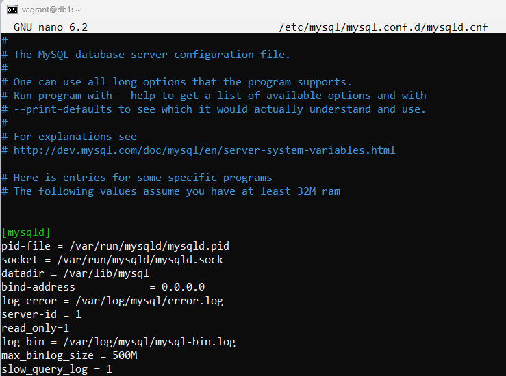
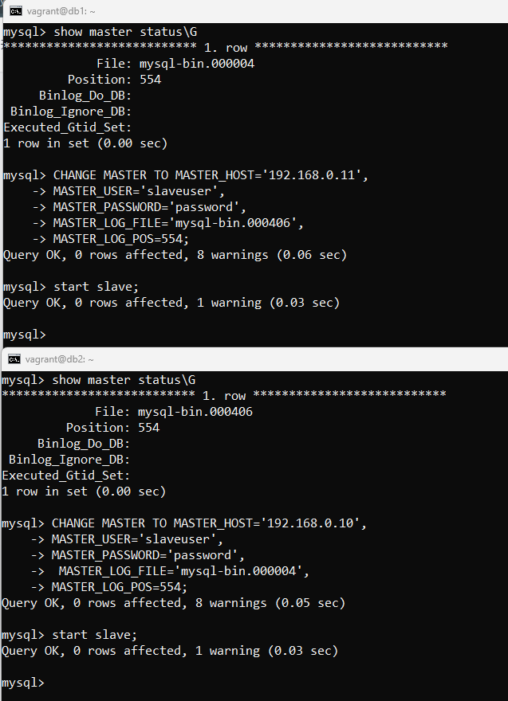
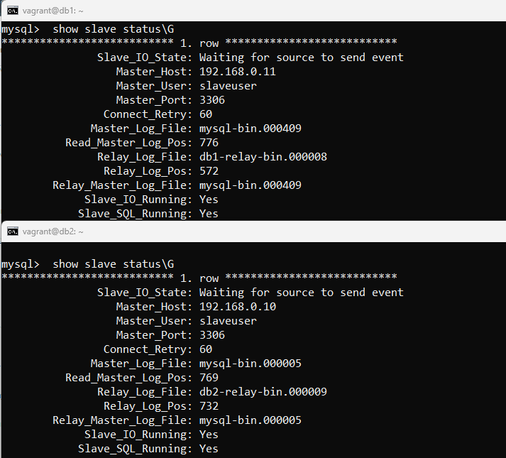

# Домашнее задание к занятию «Репликация и масштабирование. Часть 1»


### Задание 1

На лекции рассматривались режимы репликации master-slave, master-master, опишите их различия.

*Ответить в свободной форме.*
### Решение 1

Репликация master-slave подразумевает наличие одного мастера и необходимое количество подчиненных устройств, но запись/изменения производятся только на мастере. 
При реплекации master-master - сервера одновременно выступают и мастером и подчиненным,соответсвенно запись/изменения можно производить на любом мастере.

---

### Задание 2

Выполните конфигурацию master-slave репликации, примером можно пользоваться из лекции.

*Приложите скриншоты конфигурации, выполнения работы: состояния и режимы работы серверов.*

### Решение 2

Так как Master-Master репликации – это настройка обычной Master-Slave репликации, только в обе стороны (каждый сервер является мастером и слейвом одновременно),то будем сразу делать ММ.

Используя [vagrant](./vagrantfile), создадим 2 ВМ:

db1 - 192.168.0.10 

db2 - 192.168.0.11 

Внесем изменения в /etc/mysql/mysql.conf.d/mysqld.cnf на обоих северах:


Так же раскомментируем строку:
```
general_log_file = /var/log/mysql/query.log
```
Создаем пользователя для репликации:

```
CREATE USER slaveuser@ip_slave_server IDENTIFIED WITH mysql_native_password BY 'password';
grant replication slave on *.* to slaveuser@ip_slave_server;
flush privileges;

```
После проверяем master status и , используя полученную информацию,   настроим подчиненные сервера :



Далее проверяем slave status :


